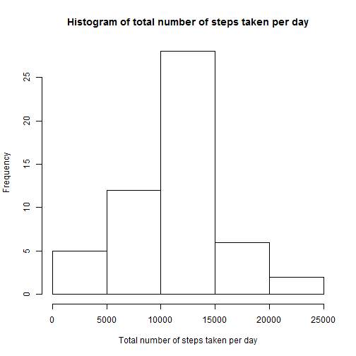
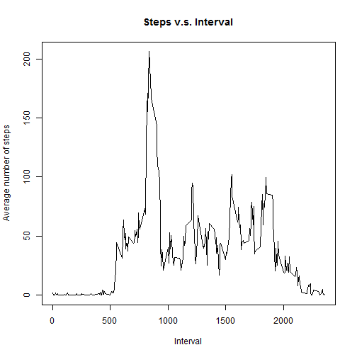
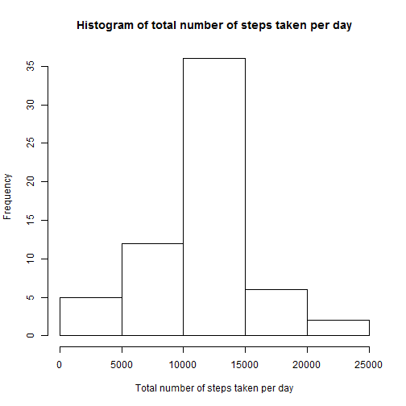
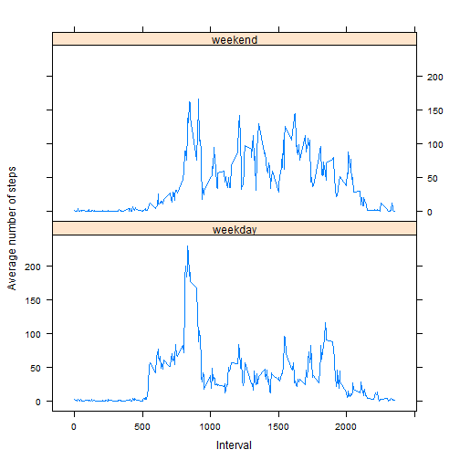

  
  

  
  
  
  
  

##1. Loading and preprocessing the data


Load the data

```r
data = read.csv("activity.csv", header = TRUE)
head(data)
```

```
##   steps       date interval
## 1    NA 2012-10-01        0
## 2    NA 2012-10-01        5
## 3    NA 2012-10-01       10
## 4    NA 2012-10-01       15
## 5    NA 2012-10-01       20
## 6    NA 2012-10-01       25
```

Process/transform the data (if necessary) into a format suitable for your analysis  
Remove NAs in column "steps" 

```r
amd = data[!is.na(data$steps), ]
head(amd)
```

```
##     steps       date interval
## 289     0 2012-10-02        0
## 290     0 2012-10-02        5
## 291     0 2012-10-02       10
## 292     0 2012-10-02       15
## 293     0 2012-10-02       20
## 294     0 2012-10-02       25
```

##2. What is mean total number of steps taken per day?


Calculate the total number of steps taken per day

Make a histogram of the total number of steps taken each day


```r
spd = aggregate(steps ~ date, data=amd, sum)
hist(spd$steps, xlab = "Total number of steps taken per day", main="Histogram of total number of steps taken per day")
```

 

Calculate and report the mean and median of the total number of steps taken per day  
Mean of the total number of steps taken per day

```r
mean(spd$steps)
```

```
## [1] 10766.19
```

Median of the total number of steps taken per day

```r
median(spd$steps)
```

```
## [1] 10765
```

##3. What is the average daily activity pattern?

Make a time series plot (i.e. type = "l") of the 5-minute interval (x-axis) and the average number of steps taken, averaged across all days (y-axis)


```r
spi = aggregate(steps ~ interval, data = amd, mean)
plot(spi$interval, spi$steps, type = "l", main = "Steps v.s. Interval", xlab = "Interval", ylab = "Average number of steps")
```

 

Which 5-minute interval, on average across all the days in the dataset, contains the maximum number of steps?

```r
max_steps = max(spi$steps)
max_int = spi[spi$steps == max_steps, c("interval")]
max_int
```

```
## [1] 835
```

##4. Imputing missing values

Note that there are a number of days/intervals where there are missing values (coded as NA). The presence of missing days may introduce bias into some calculations or summaries of the data.

Calculate and report the total number of missing values in the dataset (i.e. the total number of rows with NAs)

```r
length(which(is.na(data$steps)))
```

```
## [1] 2304
```
  
Devise a strategy for filling in all of the missing values in the dataset. The strategy does not need to be sophisticated. 
Replace each NA value by the mean of that 5-minute interval


Create a new dataset that is equal to the original dataset but with the missing data filled in.

```r
nna_data = data
for(i in 1:length(data$steps)){
  if(is.na(data$steps[i])){
    interval = data$interval[i]
    nna_data$steps[i] = spi[spi$interval == interval, c("steps")]
  }
}
head(nna_data)
```

```
##       steps       date interval
## 1 1.7169811 2012-10-01        0
## 2 0.3396226 2012-10-01        5
## 3 0.1320755 2012-10-01       10
## 4 0.1509434 2012-10-01       15
## 5 0.0754717 2012-10-01       20
## 6 2.0943396 2012-10-01       25
```


Make a histogram of the total number of steps taken each day and Calculate and report the mean and median total number of steps taken per day. Do these values differ from the estimates from the first part of the assignment? What is the impact of imputing missing data on the estimates of the total daily number of steps?


```r
nna_spd = aggregate(steps ~ date, data=nna_data, sum)
hist(nna_spd$steps, xlab = "Total number of steps taken per day", main="Histogram of total number of steps taken per day")
```

 

Mean of the total number of steps taken per day

```r
mean(nna_spd$steps)
```

```
## [1] 10766.19
```
This value is not different from the first part of this assignment since the mean of each interval was added into the NAs.  


Median of the total number of steps taken per day

```r
median(nna_spd$steps)
```

```
## [1] 10766.19
```
This median value is different from the first part.  


##5. Are there differences in activity patterns between weekdays and weekends?

For this part the weekdays() function may be of some help here. Use the dataset with the filled-in missing values for this part. 

Create a new factor variable in the dataset with two levels - "weekday" and "weekend" indicating whether a given date is a weekday or weekend day.  


```r
d_list = as.Date(nna_data$date)
day_type = character()
for(i in 1:length(d_list)){
  if(weekdays(d_list[i]) == "Saturday" | weekdays(d_list[i]) == "Sunday"){
    day_type[i] = "weekend"
  }
  else{day_type[i] = "weekday"}
}
data3 = cbind(nna_data, day_type)
head(data3)
```

```
##       steps       date interval day_type
## 1 1.7169811 2012-10-01        0  weekday
## 2 0.3396226 2012-10-01        5  weekday
## 3 0.1320755 2012-10-01       10  weekday
## 4 0.1509434 2012-10-01       15  weekday
## 5 0.0754717 2012-10-01       20  weekday
## 6 2.0943396 2012-10-01       25  weekday
```


Make a panel plot containing a time series plot (i.e. type = "l") of the 5-minute interval (x-axis) and the average number of steps taken, averaged across all weekday days or weekend days (y-axis). See the README file in the GitHub repository to see an example of what this plot should look like using simulated data.  


```r
library(lattice)
spi3 = aggregate (steps ~ interval + day_type, data3, mean)
xyplot(spi3$steps ~ spi3$interval | spi3$day_type, layout = c(1, 2), type = "l", xlab = "Interval", ylab = "Average number of steps")
```

 
